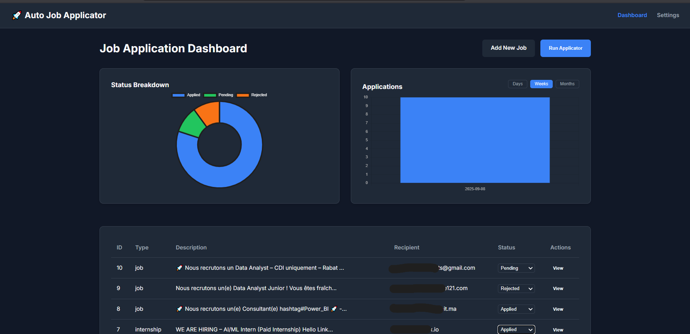

# Auto Job Applicator - Mission Control

**Auto Job Applicator** is a self-hosted, personal web application that acts as a "Mission Control" for your job search. It leverages the power of Google's Gemini AI to automate the tedious parts of applying for jobs, allowing you to manage, track, and apply for opportunities from a single, clean dashboard.

This project transforms the manual process of editing files and running scripts into a streamlined, user-friendly web experience, using a local SQLite database to keep all your information secure and organized.

### **Dashboard**


### **Settings**


---

## ✨ Key Features

* **📊 Interactive Dashboard:** A central hub to view all your job applications. See the status of each application, view details, and get a visual overview of your progress with interactive charts.
* **🤖 AI-Powered Email Generation:** Uses the Gemini AI to analyze job descriptions and your personal profile to craft unique, tailored application emails for each role.
* **⚙️ Secure Configuration:** A dedicated settings page to securely manage your personal information, CV link, and secret API keys. Your keys are stored locally and never exposed on the frontend.
* **📈 Live Analytics:** The dashboard includes dynamic charts that break down your application statuses and track your application frequency over time, with filters for daily, weekly, and monthly views.
* **⚡️ Interactive Job Management:**
    * **Quick View:** View the full details of any job in a pop-up modal without leaving the dashboard.
    * **Live Status Updates:** Change the status of an application (e.g., from "Applied" to "Interviewing") directly from the dashboard table, with changes reflected instantly in the analytics.
* **🔒 Secure & Private:** The entire application runs locally on your machine. Your data, API keys, and job history are stored in a private SQLite database on your computer and never leave your control.

---

## 🛠️ Tech Stack

This project is built with a modern, professional Python web stack.

* **Backend:** **Python 3** with **Flask**
* **Database:** **SQLite** with the **Flask-SQLAlchemy** ORM
* **Frontend:** Server-side rendered **Jinja2** templates
* **Styling:** Custom **CSS** for a clean, modern dark theme
* **AI Model:** **Google Gemini API** (`gemini-2.5-flash`)
* **Google Services:** **Gmail API** for sending emails
* **Data Analysis:** **Pandas** for processing analytics data
* **Charting:** **Chart.js** for interactive data visualizations

---

## 📂 Project Structure

The project uses a standard, simplified Flask application structure for clean code and maintainability.

```

job-app-mission-control-final/
│
├── .env                  \# For storing secret API keys
├── credentials.json      \# Google Cloud OAuth 2.0 credentials
├── instance/             \# Auto-generated folder for the database
│   └── database.db
├── requirements.txt
├── app.py                \# Main application entry point
├── models.py             \# SQLAlchemy database models
├── routes.py             \# Flask routes and page logic
├── services.py           \# Core business logic (AI, email, etc.)
│
├── static/
│   └── style.css         \# All custom CSS for styling
│
└── templates/
├── add\_job.html
├── base.html
├── dashboard.html
└── settings.html

````

---

## 🚀 Setup and Installation

Follow these steps to get the application running on your local machine.

### 1. Prerequisites
* Python 3.10+
* A package manager like `pip`
* A Google Cloud account for API access

### 2. Clone the Repository
```bash
git clone https://github.com/ayoubmori/Gemini-Job-Applicator---V2.git
cd Gemini-Job-Applicator---V2
````

### 3\. API Key Setup

You need two sets of credentials for this project to function.

**A. Google Cloud Credentials (`credentials.json`)**
This authorizes the application to send emails on your behalf.

1.  Go to the [Google Cloud Console](https://console.cloud.google.com/) and create a new project.
2.  Enable the **Gmail API**.
3.  Go to "APIs & Services" \> "Credentials".
4.  Click "Create Credentials" \> "OAuth client ID".
5.  Choose **"Desktop app"** as the application type.
6.  Download the JSON file and **rename it to `credentials.json`**.
7.  Place this file in the **root directory** of the project.

**B. Gemini API Key**
This key is for the AI model that generates emails.

1.  Go to the [Google AI Studio](https://aistudio.google.com/app/apikey).
2.  Click **"Create API key in new project"**.
3.  Copy the generated API key.

### 4\. Configure Your Environment

1.  Create a file named `.env` in the root of the project.
2.  Add your Gemini API key to this file:
    ```
    # .env
    GOOGLE_API_KEY="paste_your_gemini_api_key_here"
    ```

### 5\. Install Dependencies

It is highly recommended to use a virtual environment to keep dependencies clean.

```bash
# Create a virtual environment
python -m venv .venv

# Activate it
# On Windows: .venv\Scripts\activate
# On Mac/Linux: source .venv/bin/activate

# Install the required packages
pip install -r requirements.txt
```

### 6\. Run the Application

```bash
python app.py
```

The application will be available at **http://127.0.0.1:5000**.

-----

## 📖 How to Use

1.  **First-Time Google Authentication:** On the very first time you click "Run Applicator," a browser window will open asking you to log in to your Google account and grant permission for the app to send emails. This is a one-time process. A `token.json` file will be created to store your authorization.
2.  **Configure Settings:** The first and most important step is to navigate to the **Settings** page and fill in all your personal information and your Gemini API key.
3.  **Add Jobs:** Go to the **Dashboard** and click "Add New Job" to start populating your application list.
4.  **Analyze & Apply:** Use the dashboard to view your job list and analytics. When you're ready, click "Run Applicator" to have the AI generate and send emails for all your "Pending" jobs.

-----

## 🌟 Future Improvements

This project has a solid foundation that can be extended with even more powerful features:

  * **Autonomous Job Scouter:** An automated script that scrapes job boards for new openings and adds them to your database.
  * **Dynamic CV Tailoring:** Use the AI to rewrite parts of your CV to match each specific job description before applying.
  * **AI-Powered Match Analysis:** An "Analyze" button that gives you a match score and a breakdown of how your skills align with a job description *before* you apply.

-----

## 👨‍💻 Author

**Ayoub Taouabi**

  * **GitHub:** [@ayoubmori](https://www.google.com/search?q=https://github.com/ayoubmori)
  * **LinkedIn:** [linkedin.com/in/ayoub-taouabi](https://www.google.com/search?q=https://linkedin.com/in/ayoub-taouabi)
